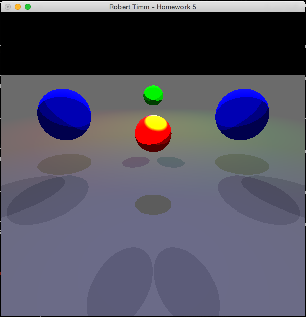
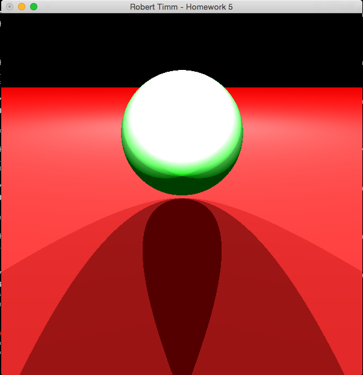
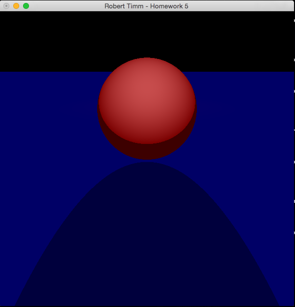
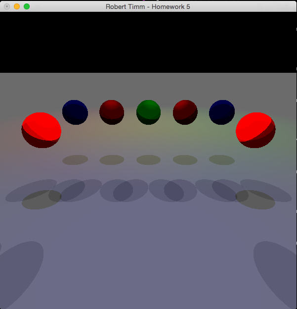

## CSCE-441-Project-5

### Notes
For this project I had to implement a ray-tracing algorithm for rendering various scenes in OpenGL using various light sources, objects and lighting conditions. 

### Controls
* 'q' to quit
* '1' to render base scene with specular, diffuse, and ambient with a plane and four spheres.
* '2' to render a specular scene
* '3' to render a diffuse scene
* '4' to render eight objects with reflections

### Screenshots
Scene 1 - base rendering requirements

Scene 2 - specular example

Scene 3 - diffuse example

Scene 4 - eight objects with various settings

